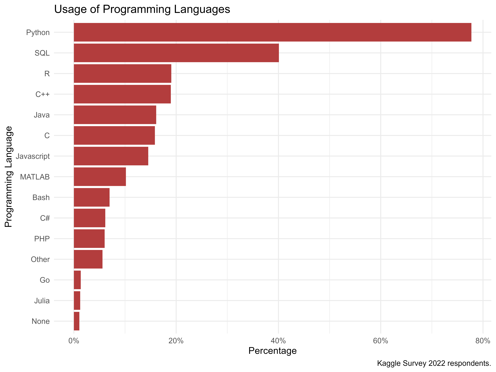
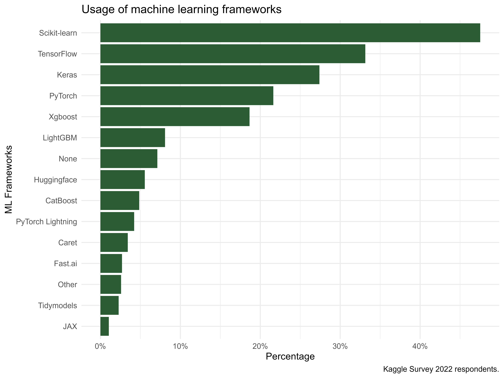
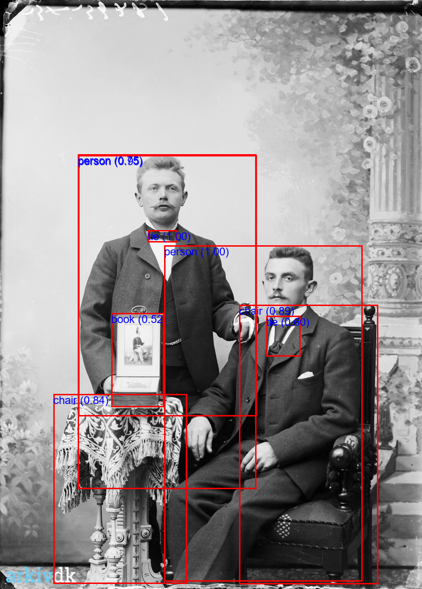
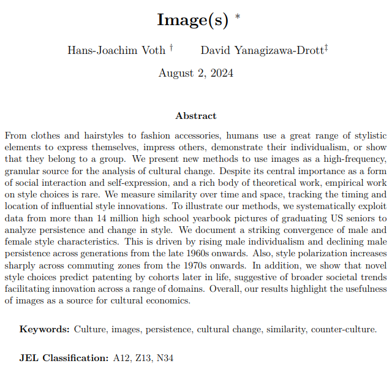
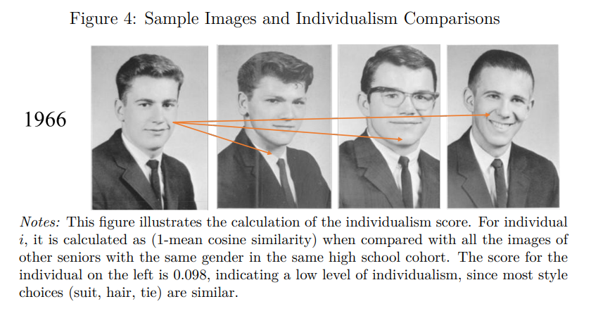
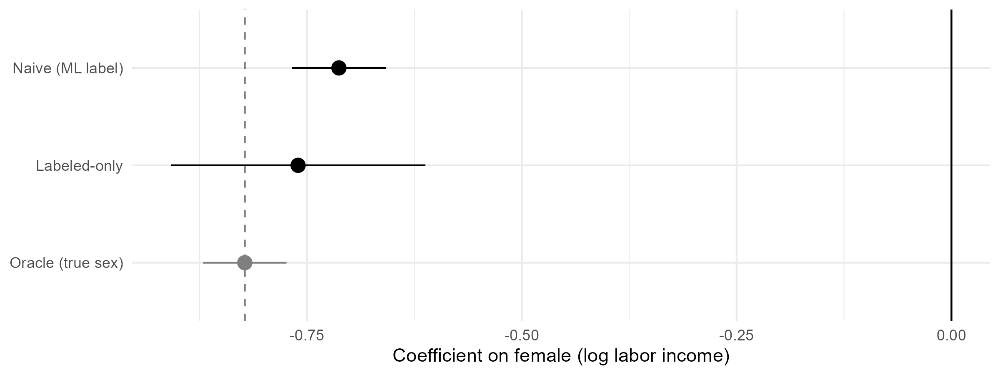
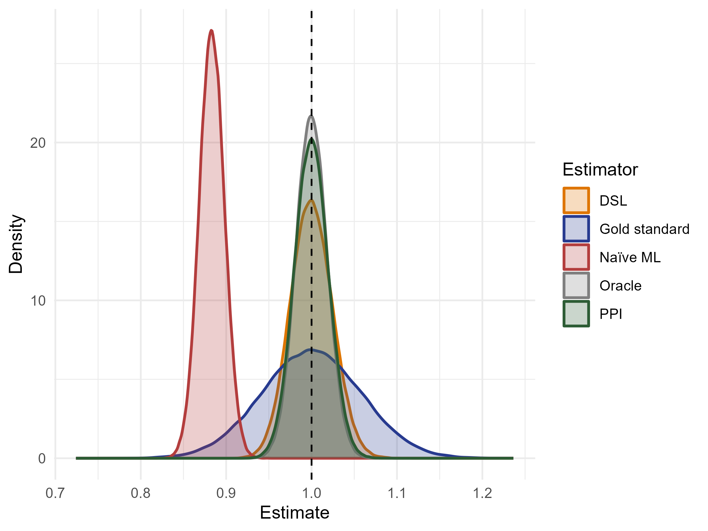
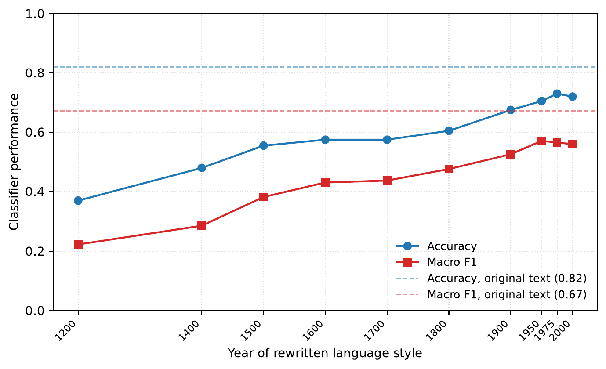
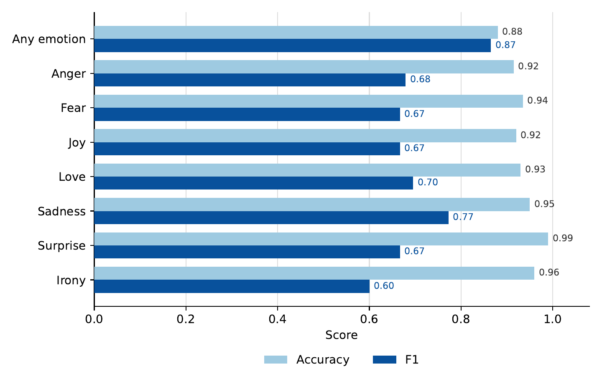

---
output:
  xaringan::moon_reader:
    seal: false
    includes:
      after_body: insert-logo.html
    self_contained: false
    lib_dir: libs
    nature:
      highlightStyle: github
      highlightLines: true
      countIncrementalSlides: false
      ratio: '16:9'
editor_options:
  chunk_output_type: console
---
class: center, inverse, middle

```{r xaringan-panelset, echo=FALSE}
xaringanExtra::use_panelset()
```

```{r xaringan-tile-view, echo=FALSE}
xaringanExtra::use_tile_view()
```

```{r xaringanExtra, echo = FALSE}
xaringanExtra::use_progress_bar(color = "#808080", location = "top")
```

```{r setup, include=FALSE}
knitr::opts_chunk$set(eval=TRUE, include=TRUE, cache=TRUE)
library(reticulate)
use_condaenv("hedg-summer-school")
```

```{css echo=FALSE}
.pull-left {
  float: left;
  width: 44%;
}
.pull-right {
  float: right;
  width: 44%;
}
.pull-right ~ p {
  clear: both;
}


.pull-left-wide {
  float: left;
  width: 66%;
}
.pull-right-wide {
  float: right;
  width: 66%;
}
.pull-right-wide ~ p {
  clear: both;
}

.pull-left-narrow {
  float: left;
  width: 30%;
}
.pull-right-narrow {
  float: right;
  width: 30%;
}

.tiny123 {
  font-size: 0.40em;
}

.small123 {
  font-size: 0.80em;
}

.large123 {
  font-size: 2em;
}

.red {
  color: red
}

.orange {
  color: orange
}

.green {
  color: green
}
```

# Historical Perspectives on Current Economic Issues: Big Data and Applications
## *AI/ML for language and vision*
### Lecture 1: Off-the-shelf models & debiasing

Torben Skov Dyg Johansen ([tsdj@sam.sdu.dk](mailto:tsdj@sam.sdu.dk))
Assistant Professor of Econometrics and Data Science at SDU
[torbensdjohansen.github.io](https://torbensdjohansen.github.io/)

Christian Vedel ([christian-vs@sam.sdu.dk](mailto:christian-vs@sam.sdu.dk))
Assistant Professor of Economic History
[sites.google.com/view/christianvedel](https://sites.google.com/view/christianvedel)

### Updated `r Sys.Date()`

---
class: middle
# Today's lecture

.pull-left-wide[
**Taking the plunge into using some of the tools.**

- Balance between showing *what* can be done and *how* to do it — more towards *how*
- The first bit should be fine for everyone to follow along, but difficulty increases between now and the end of tomorrow
- Some of it will be hard, but this is an advanced class
]

.pull-right-narrow[

]

--

.pull-left-wide[
**Plan for the two days:**

1. **Off-the-shelf models** *(today):* how to run advanced ML pipelines for text and image analysis in a couple of lines of code
2. **Debiasing** *(today):* what to do when the variable in your regression came out of a model
3. **Introduction to OccCANINE:** how to use it and how to build something similar (a neural network for text classification)
4. **Transcription:** how to run AI transcription on scanned documents
]

---
class: inverse, middle, center
# Python

---
# Python

.pull-left-wide[
- The single most important language for machine learning
- R can do *some* stuff. But not everything we show you today
- Easy language
]

---
## Popular languages

.center[

]

---
## Popular frameworks

.center[

]

---
## Getting started with Python

.pull-left-wide[
### Colab
- We will use google colab: [colab.research.google.com](https://colab.research.google.com/)

### Proper setup
- Install anaconda
- Make environment `conda create --name my_env`
- `conda install spyder`
- Find *plenty* via Google

### Programming logic
- Play "The Farmer Was Replaced": [store.steampowered.com/app/2060160](https://store.steampowered.com/app/2060160/The_Farmer_Was_Replaced/)
]

---
class: inverse, middle, center
# HuggingFace & the `pipeline` interface

---
## HuggingFace

.pull-left-wide[
- HuggingFace is a platform for sharing machine learning models
- Most of the most advanced pre-trained models are available here
- You can use them *off the shelf* or finetune them. Plenty of guidance available
]

.pull-right-narrow[

]

---
# .red[Exercise: Exploring HuggingFace]

.pull-left-wide[
- Try navigating to [HuggingFace.co](https://huggingface.co/)
- Look for a model for one of the following tasks: Image Classification, Text Classification, Zero-Shot Classification, Translation, Sentence Similarity
- Take a picture of yourself (or find one on the internet) and try this tool: [huggingface.co/spaces/schibsted-presplit/facial_expression_classifier](https://huggingface.co/spaces/schibsted-presplit/facial_expression_classifier)
]

---
## `pipeline`

.pull-left-wide[
- You can interact with many of these models using the `pipeline` interface of the `transformers` library
- You make an *instance* of a model by calling `pipeline(task = "...")`
- You can find an overview of tasks here: [huggingface.co/docs/transformers/main/en/quicktour#pipeline](https://huggingface.co/docs/transformers/main/en/quicktour#pipeline)
]

---
class: inverse, middle, center
# Demonstration 1: Vision

---
# Demonstration 1: Vision

.pull-left-wide[
- Automatic image description
- Automatic image object detection
]

.pull-right-narrow[

.small123[Picture from [arkiv.dk](https://arkiv.dk/vis/7055378)]
]

---
## Demo 1.1: Automatic caption

.pull-left-wide[
```python
from transformers import pipeline
model = pipeline(
    task="image-to-text",
    model = "Salesforce/blip-image-captioning-base"
)

results = model("Figures/arkivdk7055378.png")
```
]

--

.pull-left-wide[
```python
print(results)
```
```
[{'generated_text': 'two men sitting on a chair in front of a wall'}]
```
]

---
## Demo 1.2: Object detection

.pull-left-wide[
```python
from transformers import pipeline

model = pipeline("object-detection", model = "facebook/detr-resnet-50")
results = model("Figures/arkivdk7055378.png")
# ... add a bit of code to draw the objects found
```
]

--

.center[

]

---
## Application: reading historical images at scale

.center[

]

---
## Application: reading historical images at scale

.center[

]

.small123[Find the working paper here: [www.jvoth.com/images_july_24.pdf](https://www.jvoth.com/images_july_24.pdf)]

---
class: inverse, middle, center
# Demonstration 2: Natural Language Processing

---
## About NLP

.pull-left-wide[
- Natural Language Processing used to be based on *Bag of Words* (BoW) and *rule-based* methods informed by Grammar and Linguistics
- The old approach still has some merit (simple topic models, very fast compute in financial applications, etc.)
- Instead we use *masked* transformer language models trained on next token prediction
  - Justification: *it turns out you need to implicitly understand language to predict it*
]

---
## Language models: a quick and dirty tour of the landscape

.pull-left-wide[
- Old models: based on LSTM
- New models: based on transformers
- Small Language Models: 50m to 1b parameters
- Large Language Models: >1b parameters
]

---
## Demo 2.1: Sentiment analysis

.pull-left-wide[
```python
from transformers import pipeline
classifier = pipeline(
    task = "sentiment-analysis",
    model = "distilbert/distilbert-base-uncased-finetuned-sst-2-english"
)
result = classifier("It is a lot of fun to learn advanced ML stuff.")
```
]

--

.pull-left-wide[
```python
print(result)
```
```
[{'label': 'POSITIVE', 'score': 0.9997534155845642}]
```
]

---
## Demo 2.2: Named Entity Recognition

.pull-left-wide[
```python
from transformers import pipeline
model = pipeline(task = "ner", model = "dslim/bert-base-NER")
result = model(
    """
    Mr. Edward Jameson, born on October 15, 1867, in Concord, Massachusetts,
    is a gentleman of notable accomplishments. He received his early
    education at the local academy and graduated with honors from Harvard
    College in 1888. Pursuing a career in law, he quickly rose to prominence
    through his sagacity and dedication."
    """
)
```
]

--

.pull-left-wide[
.small123[
```
B-PER: Edward; Probability: 0.998
I-PER: Jameson; Probability: 0.998
B-LOC: Concord; Probability: 0.991
B-LOC: Massachusetts; Probability: 0.999
B-ORG: Harvard; Probability: 0.998
I-ORG: College; Probability: 0.997
```
]
]

---
## Demo 2.3: Translation

.pull-left-wide[
```python
from transformers import pipeline

translator = pipeline("translation_en_to_fr", model = "google-t5/t5-base")

text = "Hello, do you like machine learning and economic history?"

results = translator(text)
```
]

--

.pull-left-wide[
```python
for result in results:
    print(f"Translated Text: {result['translation_text']}")
```
```
Translated Text: Bonjour, aimez-vous l'apprentissage automatique et l'histoire économique ?
```
]

---
## Demo 2.4: Text generation from a Large*ish* Language Model

.pull-left-wide[
.small123[
```python
from transformers import pipeline
import torch

model = pipeline(
    task = "text-generation",
    model = 'HuggingFaceH4/zephyr-7b-beta',
    torch_dtype=torch.bfloat16,
    device_map='auto',
    )
result = model(
    "The technical aspects of economic history",
    max_length=50,
    truncation=True,
    )
```
]
]

--

.pull-left-wide[
.small123[
```
[{'generated_text': 'The technical aspects of economic history, such as the
study of prices, wages, and interest rates, are also important in
understanding the economic development of a region.

In summary, economic history is a multidisciplinary field that combines'}]
```
]
]

---
## Extension: you can also provide context

.pull-left-wide[
.small123[
```python
messages = [
    {
        "role": "system",
        "content": """
        You are a friendly econometrician who's interested in advanced
        statistical techniques for Economic History. You want people to
        understand the importance of advanced methods.
        """,
    },
    {
        "role": "user",
        "content": "Can we do good economic history research without all the technicalities?"
    },
]
prompt = model.tokenizer.apply_chat_template(
    messages, tokenize=False, add_generation_prompt=True
)
outputs = model(
    prompt, max_new_tokens=128, do_sample=True, temperature=0.7,
    top_k=10, top_p=0.95
)
```
]
]

--

.pull-left-wide[
.tiny123[
```
"As an econometrician, my answer is that while it's possible to conduct
economic history research without advanced statistical techniques, the
results may be less accurate and reliable. Historical data is often
incomplete, noisy, and subject to various forms of uncertainty, which can
make it challenging to draw meaningful conclusions without the use of
advanced statistical methods. By applying advanced techniques like time
series analysis, panel data models, and Bayesian methods, we can better
account for these sources of uncertainty..."
```
]
]

---
# .red[Exercise: Running advanced ML model yourself]

.pull-left-wide[
You are tasked with running an automated and scalable analysis of *Notes from the Underground* by Dostoevsky

- Go to [colab.research.google.com/drive/1YmzV2A40B3KsnTycavg2I9IxLk4DS1g-?usp=sharing](https://colab.research.google.com/drive/1YmzV2A40B3KsnTycavg2I9IxLk4DS1g-?usp=sharing)
- Copy the notebook and do the exercises
]

---
class: inverse, middle, center
# When your data is a prediction

---
## Everything we ran today produced a prediction

- A caption for a photograph
- A box around an object
- A sentiment score for a sentence
- A person or place picked out of a text
- A sentence in French

--

Not one of them is an observation.
Each is a model's prediction:

$$\text{source } X_i \;\longrightarrow\; \hat{Z}_i = f(X_i)$$

--

In research, such a prediction is usually the beginning: it becomes a variable, and the variable goes into a regression

--

**The rest of the lecture**
1. How we normally judge a model: **accuracy**, **precision**, **recall**, **F1**
2. Why those numbers are not the ones we *really* care about
3. What to do about it

---
class: inverse, middle, center
# Measuring model quality

---
## How good is a classifier?

A model sorting observations into two classes can be wrong in two different ways.

|  | Actually positive | Actually negative |
|---|---|---|
| **Predicted positive** | true positive (*TP*) | false positive (*FP*) |
| **Predicted negative** | false negative (*FN*) | true negative (*TN*) |

--

We typically measure the performance of a classifier using either:
- **Accuracy:** share of all cases classified correctly
- **Precision:** of the cases called positive, the share that really are
- **Recall:** of the cases that really are positive, the share the model found
- **F1:** the harmonic mean of precision and recall

$$\text{Accuracy} = \frac{TP+TN}{n}, \qquad \text{Precision} = \frac{TP}{TP+FP}$$
$$\text{Recall} = \frac{TP}{TP+FN}, \qquad F_1 = \frac{2\,TP}{2\,TP+FP+FN}$$

---
## Example: Classifying sex

.pull-left[
.small123[
| Name | Truth | Predicted |
|---|---|---|
| Anna | female | female |
| Elsa | female | female |
| Maria | female | female |
| Greta | female | female |
| Astrid | female | male |
| Kerstin | female | male |
| Ola | male | female |
| Erik | male | male |
| Gustav | male | male |
| Nils | male | male |
]
]

--

.pull-right[
A classifier guessing sex from the first name. **Female** is the positive class.

|  | Actual female | Actual male |
|---|---|---|
| **Predicted female** | 4 | 1 |
| **Predicted male** | 2 | 3 |

So $TP = 4$, $FP = 1$, $FN = 2$, $TN = 3$
]

--

.pull-right[
Accuracy $7/10 = 0.70$, precision $4/5 = 0.80$, recall $4/6 \approx 0.67$, $F_1 = \frac{2 \cdot 4}{2 \cdot 4 + 1 + 2} \approx 0.73$.
]

---
## How good is a regressor?

When the outcome is continuous, a model is not simply right or wrong. It misses by a **residual** on every observation:

$$e_i = Y_i - \hat{Y}_i$$

--

We typically measure the performance of a regressor using either:
- **Mean squared error:** the average squared residual
- **R-squared:** the share of the variation in $Y$ that the model accounts for

$$\text{MSE} = \frac{1}{n}\sum_{i=1}^{n}\big(Y_i - \hat{Y}_i\big)^2, \qquad R^2 = 1 - \frac{\sum_i \big(Y_i - \hat{Y}_i\big)^2}{\sum_i \big(Y_i - \bar{Y}\big)^2}$$

---
## Empirical example: Stockholm taxpayers, 1920

- 3,271 individuals with first names and labor income (Bengtsson & Molinder, 2024)
- We want the **gender wage gap**: regress log labor income on being female
- Problem: suppose we only observe gender for some observations
- "Solution": We have predictions of gender for all observations

```{r load-stockholm, echo = F}
stockholm <- read.csv("Debiasing_exercises/Stockholm1920.csv")
head(stockholm)
```

--

How often do we correctly predict someone is female?

```{r, echo = F}
table(predicted = stockholm$female_pred, actual = stockholm$female)
```

---
# .red[Exercise: Gender wage gap]

**TODO** refer to notebook

1. For observations where you observe the actual sex, compute the accuracy, precision, recall, and $F_1$-score of the predicted genders
2. Regress `log_labor_income` on `female_pred` using **all** observations. What is the estimated gender wage gap?
3. Regress `log_labor_income` on `female` using observations where gender is observed. What is the estimated gender wage gap?
4. Which estimate do you trust the most?

```{r exercise-gap-solution, echo = FALSE, eval = FALSE}
cm <- table(predicted = stockholm$female_pred, actual = stockholm$female)
c(accuracy = sum(diag(cm))/sum(cm), precision = cm[2,2]/sum(cm[2,]), recall = cm[2,2]/sum(cm[,2]), f1 = 2*cm[2,2]/(2*cm[2,2]+cm[2,1]+cm[1,2]))

summary(lm(log_labor_income ~ female_pred, data = stockholm))

summary(lm(log_labor_income ~ female, data = stockholm))
```

---
class: inverse, middle, center
# What is the problem?

---
## We measured the wrong thing

We do not ultimately care about a classifier's accuracy.
We care about
1. whether $\hat{\beta}$ is centered on the truth (unbiased - or at least consistent)
1. how precisely we measure it (efficiency)

Let us compare our two estimates as well as the "truth"

--

```{r comparison-table, echo = F, results = "asis"}
b <- function(f) summary(f)$coefficients[2, 1:2]
ci <- function(x) sprintf("[%.3f, %.3f]", x[1] - 1.96*x[2], x[1] + 1.96*x[2])
naive <- b(lm(log_labor_income ~ female_pred, stockholm))
gold <- b(lm(log_labor_income ~ female, stockholm))
knitr::kable(data.frame(
  Estimator = c("Truth", "Naive (predicted sex, all)", "Gold standard (observed sex only)"),
  Estimate = sprintf("%.3f", c(-0.822, naive[1], gold[1])),
  `95% CI` = c("", ci(naive), ci(gold)),
  check.names = FALSE
), format = "markdown", row.names = FALSE)
```

--

- Our estimate using predictions is clearly biased ...
- ... but our estimate using only observed gender is measured less precisely

---

## The same three estimates

.center[

]

.small123[
Dashed line: the "true" gap. Solid line: no gap at all. Bars are 95% confidence intervals.
]

---
## Two kinds of measurement error

|  | Classical | ML prediction |
|---|---|---|
| Structure | random noise | systematic |
| Effect on the coefficient | attenuation | any direction, any size |

--

Errors in our setting
- Recall is 66.2%, so 33.8% of women are labelled men.
- Precision is 98.0%, so men are almost never labelled women

--

The misclassification sits almost entirely in one class. 
It does not average out, and it pushes the coefficient in one direction

--

Egami et al. (2024): precision above 90-95% can still produce bias large enough to **flip the sign** of a coefficient

---
class: inverse, middle, center
# Debiasing

---
## Debiasing

Debiasing provides a way for us to combine the best of our two previous estimates
1. Use our ML predictions for precision
1. Use our subset of "gold standard" labels to correct the bias

--

Let us focus on the simplest possible setting, namely estimation of a mean of a variable $Y$.
Our setting:
- $N$ observations $(R_iY_i, \hat{Y}_i, X_i, R_i)$
- For each we have features $X_i$ and a prediction $\hat{Y}_i = f(X_i)$
- For a random subset $n \ll N$ we observe $Y_i$. Let $R_i = 1$ for those and otherwise $0$. Suppose those are the first $n$ observations

Let us consider different estimation strategies for the mean of $Y$

---
## Option 1: use only what you know

$$\hat{\theta}_{GS} = \frac{1}{n}\sum_{i=1}^{n} Y_i$$

**Unbiased**, because the subset was drawn at random

--

But it discards $N-n$ observations. Noisy

---
## Option 2: use all the predictions

$$\hat{\theta}_{ML} = \frac{1}{N}\sum_{i=1}^{N} f(X_i)$$

**Precise**, because it uses everything

--

But biased by the average prediction error, which we have no reason to believe is zero

---
## Option 3: the step in between

On the labelled subset we can see **both** $f(X_i)$ and $Y_i$.
We can thus simply measure the bias:

$$\widehat{\text{bias}} = \frac{1}{n}\sum_{i=1}^{n}\big(f(X_i) - Y_i\big)$$

--

We can now combined this bias correction with our full set of ML predictions

$$\hat{\theta}_{\text{DB}} = \frac{1}{N - n} \sum_{i = n + 1}^N f(X_i) - \underbrace{\frac{1}{n} \sum_{i = 1}^n \left( f(X_i) - Y_i \right)}_{\text{Bias correction term}}$$

---
## Debiasing frameworks

The two most prominent methods of using debiasing is **prediction-powered inference** (PPI; Angelopoulos et al., 2023) and design-based supervised learning (DSL; Egami et al., 2023, 2024).
On the previous slide, we used PPI for debiasing

--

The core idea of both approaches is to correct predictions by estimating bias on a subset of observations for which "gold standard" labels are available

--

**DSL** does the same job by building a *pseudo outcome* for every observation and then simply averaging it

$$\tilde{Y}_i = f(X_i) + \frac{R_i}{\pi}\big(Y_i - f(X_i)\big), \qquad \hat{\theta}_{\text{DSL}} = \frac{1}{N}\sum_{i=1}^{N} \tilde{Y}_i$$

where $\pi$ is the probability that an observation gets a gold-standard label (here $\pi \approx n/N$)

--

**Note**: Both PPI and DSL differ once we move on from simple mean estimation, but the core idea remains the same

---
## Why it works

**Validity comes from the sampling design, not from the model**

The subset is a random draw, so the measured error is an unbiased estimate of the true average error, whatever the model happens to do

--

**The model buys precision**

The variance depends on how much the prediction errors vary.
A weak model costs you precision, not unbiasedness

---
# .red[Exercise: Estimation of a mean]

Let $X_i \sim U(0,1)$ and $Y_i = 2X_i$, so the true mean is $\theta = 1$. 
Use the deliberately imperfect predictor $f(X_i) = 2.1 X_i - 0.5 X_i^2$

1. Generate a random sample of size $N = 1000$ according to the above data generating process (DGP). Remove $Y_i$ from 90% of the sample
2. Compute all three estimators from the last few slides (options 1-3)
3. Repeat 1,000 times and plot the three distributions. Which is the best estimator?

```{r, echo = FALSE, eval = FALSE}

library(ggplot2)
library(tidyr)
library(dplyr)

dgp_true = function(N, pi) {
  X = runif(N)
  Y = 2 * X
  R = rbinom(N, size = 1, prob = pi)

  data.frame(Y = Y, X = X, R = R)
}

ml_predictor = function(X) {
  Y_pred = 2.1 * X - 0.5 * X^2
  
  return(Y_pred)
}

estimator_gs = function(data) {
  theta_hat_gs = mean(data[data$R == 1, 'Y'])
  
  theta_hat_gs_se = sd(data[data$R == 1, 'Y']) / sqrt(sum(data$R))
  
  return(c(theta_hat_gs, theta_hat_gs_se))
}

estimator_ml = function(data) {
  theta_hat_ml = mean(data$Y_pred)
  
  theta_hat_ml_se = sd(data$Y_pred) / sqrt(NROW(data))
  
  return(c(theta_hat_ml, theta_hat_ml_se))
}

estimator_ppi = function(data) {
  data_gs = data[data$R == 1, ]
  data_ml = data[data$R == 0, ]
  
  residuals = data_gs$Y_pred - data_gs$Y
  
  theta_hat_ppi = mean(data_ml$Y_pred) - mean(residuals)
  
  theta_hat_ppi_se = sqrt(var(residuals) / NROW(data_gs) + var(data_ml$Y_pred) / NROW(data_ml))
  
  return(c(theta_hat_ppi, theta_hat_ppi_se))
}

set.seed(42)

N = 1000
pi = 0.1
num_simulations = 10000

estimates = matrix(nrow = num_simulations, ncol = 3)
std_errs = matrix(nrow = num_simulations, ncol = 3)

for (rep in 1:num_simulations) {
  data = dgp_true(N, pi)
  data$Y_pred = ml_predictor(data$X)

  # Using only gold-standard data
  est_and_se_gs = estimator_gs(data)
  estimates[rep, 1] = est_and_se_gs[1]
  std_errs[rep, 1] = est_and_se_gs[2]
  
  # Naively using ML predictions
  est_and_se_ml = estimator_ml(data)
  estimates[rep, 2] = est_and_se_ml[1]
  std_errs[rep, 2] = est_and_se_ml[2]
  
  # PPI
  est_and_se_ppi = estimator_ppi(data)
  estimates[rep, 3] = est_and_se_ppi[1]
  std_errs[rep, 3] = est_and_se_ppi[2]
}

df_long = as.data.frame(estimates) %>%
  setNames(c("Gold standard", "Naïve ML", "PPI")) %>%
  pivot_longer(cols = everything(), names_to = "estimator", values_to = "estimate")

estimator_colours = c(
  "Gold standard" = "blue",
  "Naïve ML" = "red",
  "PPI" = "green"
)

df_long %>%
  ggplot(aes(x = estimate, fill = estimator, color = estimator)) +
  geom_density(alpha = 0.25, linewidth = 0.8, adjust = 1) +
  geom_vline(xintercept = 1, linetype = "dashed") +
  scale_fill_manual(values = estimator_colours) +
  scale_color_manual(values = estimator_colours) +
  theme_minimal() +
  labs(x = "Estimate", y = "Density", fill = "Estimator", color = "Estimator")
```

---

## PPI versus DSL

.pull-left-wide[

]

.pull-right-narrow[
.small123[
**Coverage of the nominal 95% CI**

| Estimator | Coverage (%) |
|---|---|
| Oracle | 94.87 |
| Gold standard | 94.69 |
| Naïve ML | 0.00 |
| PPI | 94.87 |
| DSL | 94.83 |

Dashed line: the true mean of 1.
Same DGP as the previous exercise.
Results based on 100,000 simulations

]
]

---
## When debiasing does **not** work

- **Convenience sampling**: Coding the first 300 records is not a design. Sampling must be random
- **Unknown selection probabilities**: Every observation needs a known, strictly positive $\pi_i$.
- **Reusing observations** to fit the model *and* measure its bias. Cross-fit instead
- **A biased source.** Debiasing corrects model bias, not source bias

--

The correction is only as good as the $n$ labels behind it.
Source criticism comes before the codebook. Document the rules, the disagreements, and who did the coding

*ML complements the "careful historian." It does not replace them*

---
## Beyond estimation of means

While the mathematics get slightly more complicated, the core idea behind debiasing extends to
- Predictions on the **right-hand side** of a regression (e.g., the Stockholm example)
- Regression coefficients generally: linear, logistic, Poisson, ...
- High-dimensional fixed effects
- IV, difference-in-differences, regression discontinuity (Carlson & Dell, 2025)

**Software**: `ppi-python` in Python, and the `dsl` package in R

---
### DSL for correcting a right-hand side variable

In the Stockholm regression, the predicted variable is a *regressor*. 
Call it $Z_i$ (sex), with outcome $Y_i$ (log income) observed for everyone

DSL then replaces each ingredient of the OLS slope by a pseudo outcome

\begin{align*}
    \tilde{Z}_i &:= f(X_i) + \frac{R_i}{\pi}\left( Z_i - f(X_i) \right) & \text{Predicted values for } Z_i
    \\
    \widetilde{Z_i^2} &:= f(X_i)^2 + \frac{R_i}{\pi}\left( Z_i^2 - f(X_i)^2 \right) & \text{Predicted values for } Z_i^2
    \\
    \widetilde{Z_iY_i} &:= f(X_i) Y_i + \frac{R_i}{\pi}\left( Z_i Y_i - f(X_i) Y_i \right) & \text{Predicted values for } Z_iY_i,
\end{align*}

--

Once we have our pseudo outcomes, the DSL estimator of the slope is

\begin{align*}
    \hat{\beta}_{\text{DSL}} = \frac{\frac{1}{N}\sum_{i = 1}^N \widetilde{Z_iY_i} - (\frac{1}{N}\sum_{i = 1}^N \tilde{Z}_i)(\frac{1}{N}\sum_{i = 1}^N Y_i)}{\frac{1}{N}\sum_{i = 1}^N \widetilde{Z_i^2} - (\frac{1}{N}\sum_{i = 1}^N \tilde{Z}_i)^2},
\end{align*}

---

**TODO show how to do previous simple mean exercise with the ppi-python package**

---

## Why this matters especially for us

.pull-left-wide[

]

.pull-right-narrow[
.small123[
Take 200 texts with human emotion labels. Have an LLM rewrite each one in the English of a given period, then score them all with the same BERT classifier

On the original text: accuracy 0.82, macro F1 0.67

By 1200: accuracy 0.37

Note that LLM-rewritten prose is *easier* than a genuine historical source. This understates the problem
]
]

---
## Even frontier models

.pull-left-wide[

]

.pull-right-narrow[
.small123[
200 paragraphs of real seventeenth-century English (EEBO), labelled by a frontier LLM and, independently, by us

Accuracy looks excellent: a macro average of 0.94

F1 is 0.69 overall, and 0.60 for irony
]
]

---
## Historical sources are the hard case

- Almost every tool is pre-trained on **modern** text
- Models project present-day categories onto the past, and archaic syntax is simply harder
- So errors correlate with **period, language, region and genre**

--

Those are the covariates in our regressions. The errors are systematic in precisely the direction that biases our estimates

*If you work with historical sources, you are in the regime where debiasing matters most*

---
## Where it applies, and where it does not

.pull-left-wide[
**Type 1, ML replaces a human annotator.** Classification, linking, labeling. A gold standard can always be built, so this always works. *Most of what the field does.*
]

--

.pull-left-wide[
**Type 2, ML fills in genuinely missing data.** Works if you can validate within the source.
]

--

.pull-left-wide[
**Type 3, ML builds a new measure.** No human could produce the label, so there is no gold standard and no debiasing. Validate against multiple proxies and placebo tests instead.
]

---
# .red[Exercise: Fixing the Stockholm estimate]

Back to the regression you broke in Exercise 1. The 330 rows with `R == 1` are your gold standard.

1. Estimate the gap using **only** those 330 rows
2. Now apply the correction, using all 3,271 predictions
3. Compare all four estimates against the true value of $-0.822$


---
## What to take away

1. Every ML output is a **prediction**, and its errors are systematic rather than random
2. **No performance score** detects the resulting bias in your estimate
3. A small **random** sample of hand-coded labels lets you measure that bias and correct it
4. Validity comes from the **sampling design** - the ML model only buys precision
5. This covers most of what economic history does with ML
