---
output:
  xaringan::moon_reader:
    seal: false
    includes:
      after_body: insert-logo.html
    self_contained: false
    lib_dir: libs
    nature:
      highlightStyle: github
      highlightLines: true
      countIncrementalSlides: false
      ratio: '16:9'
editor_options:
  chunk_output_type: console
---
class: center, inverse, middle

```{r xaringan-panelset, echo=FALSE}
xaringanExtra::use_panelset()
```

```{r xaringan-tile-view, echo=FALSE}
xaringanExtra::use_tile_view()
```

```{r xaringanExtra, echo = FALSE}
xaringanExtra::use_progress_bar(color = "#808080", location = "top")
```

```{r setup, include=FALSE}
knitr::opts_chunk$set(eval=TRUE, include=TRUE, cache=TRUE)
library(reticulate)
use_condaenv("hedg-summer-school")
```

```{css echo=FALSE}
.pull-left {
  float: left;
  width: 44%;
}
.pull-right {
  float: right;
  width: 44%;
}
.pull-right ~ p {
  clear: both;
}


.pull-left-wide {
  float: left;
  width: 66%;
}
.pull-right-wide {
  float: right;
  width: 66%;
}
.pull-right-wide ~ p {
  clear: both;
}

.pull-left-narrow {
  float: left;
  width: 30%;
}
.pull-right-narrow {
  float: right;
  width: 30%;
}

.tiny123 {
  font-size: 0.40em;
}

.xtiny-code .remark-code {
  font-size: 12px;
  line-height: 1.2;
}

.small123 {
  font-size: 0.80em;
}

.large123 {
  font-size: 2em;
}

.red {
  color: red
}

.orange {
  color: orange
}

.green {
  color: green
}
```

# Historical Perspectives on Current Economic Issues: Big Data and Applications
## *AI/ML for language and vision*
### Lecture 2: From tokens to transcription

Torben Skov Dyg Johansen ([tsdj@sam.sdu.dk](mailto:tsdj@sam.sdu.dk))
Assistant Professor of Econometrics and Data Science
[torbensdjohansen.github.io](https://torbensdjohansen.github.io/)

Christian Vedel ([christian-vs@sam.sdu.dk](mailto:christian-vs@sam.sdu.dk))
Assistant Professor of Economic History
[christianvedels.github.io](https://christianvedels.github.io/)

### Updated `r Sys.Date()`

---
class: middle
# Today's lecture

.pull-left-wide[
**Yesterday we ran advanced ML pipelines off the shelf and looked at debiasing. Today we look under the hood, and build our own ML models.**

- **Neural networks for text**
- **Introduction to OccCANINE:** how to use it and how to build something similar (a neural network for text classification)
- **Transcription:** how to run transcription on scanned documents using LLMs
]

.pull-right-narrow[

]

---
### Outline

.pull-left-wide[
**Language**
3. Neural networks for text data
4. Text classification from scratch

**Vision**
1. Handwritten text recognition
2. LLMs for OCR
]

---
class: inverse, middle, center
# Neural networks for text

---
# Neural networks for text

.pull-left-wide[
In Julius' lectures, you have learned how to represent text as numerical data suitable for modelling. Our next objective is to learn *how* to model text data

One key observation is that text is somewhat similar to time series data, in that a clear *sequential* structure is present: the meaning of a word depends on its context, i.e. how it is embedded in a sentence

Modern approaches roughly fall into one of two categories:
1. Recurrent neural networks (RNNs; "classical" approach)
2. Transformers (SOTA)

Let's take a look at RNNs
]

---
## A recurrent cell of a neural network

.pull-right-narrow[
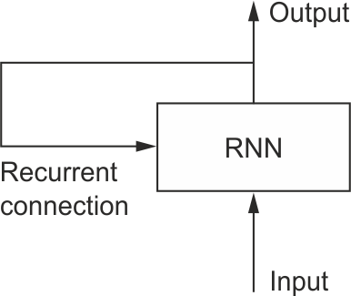
.small123[*Source*: Deep Learning with Python by Francois Chollet (ISBN10: 9781617294433)]
]

.pull-left-wide[
We have not yet specified the type of recurrent connection, just that it has the form

$$y_t = f(x_t, y_{t - 1})$$
]

--

.pull-left-wide[
We can think of an autoregressive linear model with covariates as one example

$$y_t = \alpha y_{t - 1} + \beta x_t$$
]

---
## Recurrent cells and unfolding

.pull-left-wide[
Usually, a recurrent neural network looks something like the image below — i.e. it has a "loop" where it feeds into itself (left). This can then be "unfolded" (right), in which way it looks more like a regular network, with an additional input and output ("hidden states")
]

.center[

]

.small123[*Source*: fdeloche - Own work, CC BY-SA 4.0, https://commons.wikimedia.org/w/index.php?curid=60109157]

---
## Long-term dependencies

.pull-left-wide[
A weakness of the simple recurrent neural network is that it becomes very difficult to model long-term dependencies

To address this, different architectures have been developed, typically with the primary difference being that the output $y_t$ is no longer passed on, but instead a "hidden state" is passed along

This makes modelling long-term dependencies *much* easier, as we no longer have to rely on our output being the sole information we pass along to the next step

The most commonly used architectures/"layers" are:
1. Long short-term memory (LSTM, [paper](https://ieeexplore.ieee.org/abstract/document/6795963))
2. Gated recurrent unit (GRU, [paper](https://arxiv.org/abs/1406.1078))
]

---
## Long Short-Term Memory (LSTM)

.center[

]

.small123[*Source*: fdeloche - Own work, CC BY-SA 4.0, https://commons.wikimedia.org/w/index.php?curid=60149410]

---
## Gated Recurrent Unit (GRU)

.center[

]

.small123[*Source*: fdeloche - Own work, CC BY-SA 4.0, https://commons.wikimedia.org/w/index.php?curid=60466441]

---
class: inverse, middle, center
# Case: The Problem of Occupational Encoding
### *OccCANINE* — and how to use it

---
## The problem

.pull-left-wide[
- We want to transcribe millions of records with various descriptions: "farmer", "he is a farmer", "former teacher, now farmer", "has some land he tends to", "farmr", etc.
- And we want to do this for all types of occupations
]

--

.pull-left-wide[
### *OccCANINE* to the rescue!

.center[
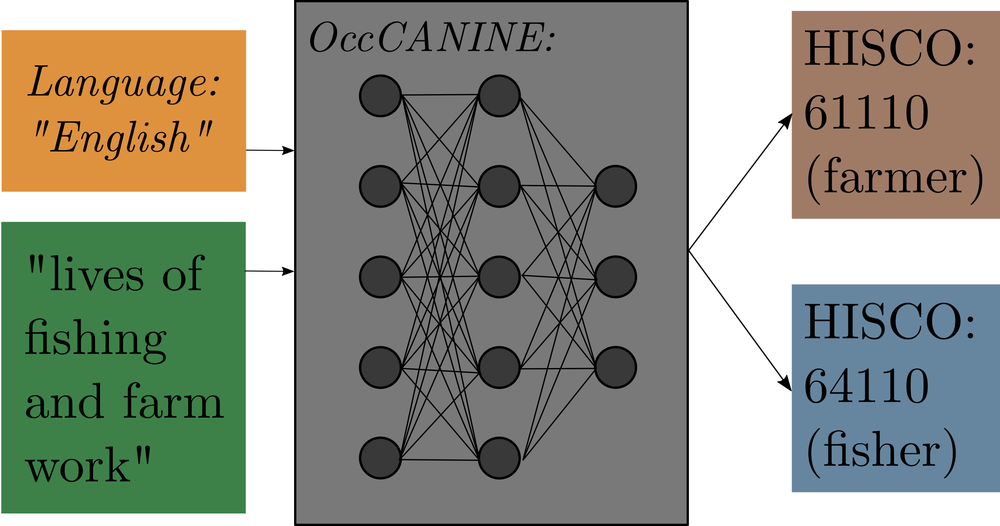
]
]

---
## *OccCANINE* architecture

.center[
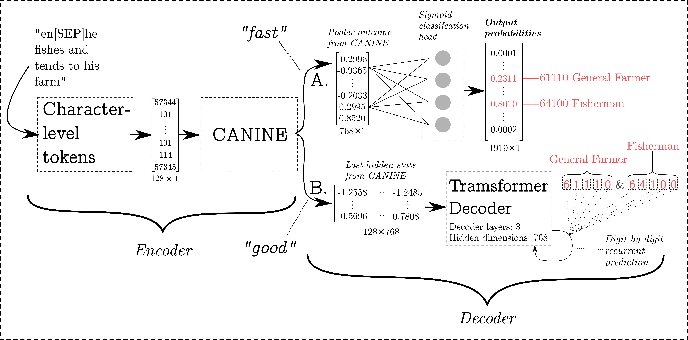
]

---
### Performance

.center[
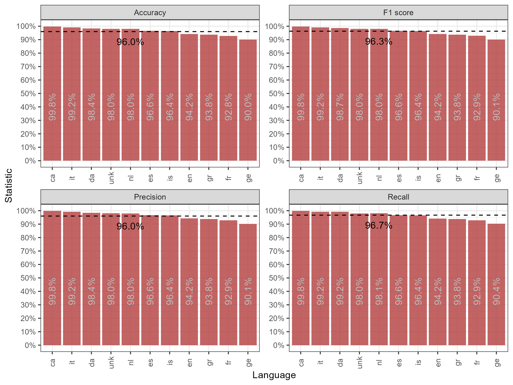
]

---
## How does it work?

.pull-left-wide[
**Concept:** Encoder-Decoder

We *encode* a conceptual understanding into an embedding space and *decode* it into classes
]

.center[
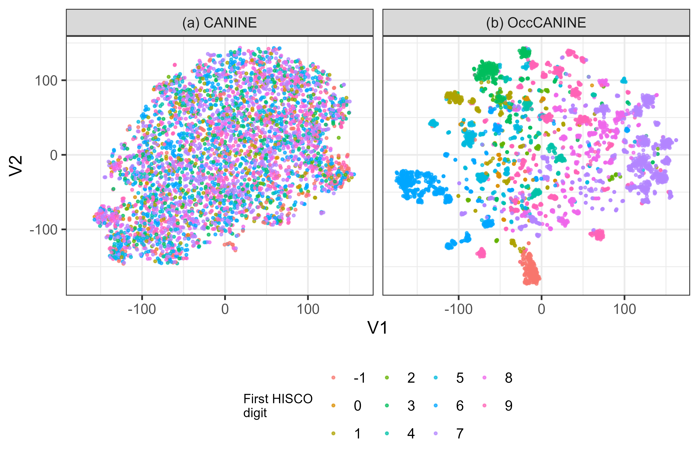
]

---
## How to use it

.pull-left-wide[
- All of this is repeated [here on YouTube](https://youtu.be/BF_oNe-sABQ?si=7jIkjYedj9rooein) and [here in a step-by-step guide](https://github.com/christianvedels/OccCANINE/blob/main/GETTING_STARTED.md)
- Entrypoint: [github.com/christianvedels/OccCANINE](https://github.com/christianvedels/OccCANINE)
]

---
### What we cover

.pull-left-wide[
- Basic functionality
- How to apply it to a lot of data
- How to finetune it

**Note of caution:**
- Performance varies by language
- You should have your application in mind when using *OccCANINE*
- Please check 200 random observations when using it
]

---
## *OccCANINE* in action

.pull-left-wide[
```{python, eval=FALSE}
from histocc import OccCANINE

model = OccCANINE()
result = model.predict(
    [
        "tailor of the finest suits",
        "local boiler maker",
        "train's fireman",
    ],
)
```
]

--

.pull-left-wide[
.tiny123[
```
                                 occ1 hisco_1                         desc_1    conf
0  unk[SEP]tailor of the finest suits   79190  Other Tailors and Dressmakers  0.5527
1          unk[SEP]local boiler maker   87350                    Boilersmith  0.4760
2             unk[SEP]train's fireman   98330    Railway SteamEngine Fireman  0.8825
```
]
]

---
## How is this useful?

.pull-left-wide[
- Andersson (2025): to study rural-urban labor dynamics in Sweden 1880-1910
- Profitt, Litvine, Chung, Linacre (2025): to provide the first ever full-count linking of the English censuses (1851-1921)
- Chilosi, Lecce, Wallis (2025): to study Smithian growth in Britain before the Industrial Revolution
- Vedel (2024): to study the effects of first nature geography on economic development
- Görges, Rove, Sharp, Vedel (2025): to study the effects of railways in Denmark
- Ford (2025): to study the development of the Scandinavian knowledge economy
- Several more — ***and*** four separate (great) master's theses at SDU last year
]

---
## Setup and use

.pull-left-wide[
We will go over this notebook: [github.com/christianvedels/OccCANINE/blob/main/OccCANINE_colab.ipynb](https://github.com/christianvedels/OccCANINE/blob/main/OccCANINE_colab.ipynb)
]

---
class: inverse, middle, center
# Building a HISCO classifier from scratch

---
# HISCO classifier

.pull-left-wide[
Let's build a simple HISCO classifier using the tools introduced:

1. **Tokenization**: we'll use character-level tokenization
2. **Embedding layer**: we'll use a 100-dimensional embedding space
3. **Recurrent layer**: we'll use a GRU layer to model dependencies

Combining these allows us to build a HISCO classifier "from scratch" which, when trained on 9,000 observations, achieves >70% test accuracy
]

---
### Building a character-level tokenizer

.tiny123[
```{python hisco-tokenizer-def, cache = FALSE}
from functools import partial

import torch
from torch import Tensor
from torch.utils.data import Dataset
import pandas as pd

CHARS_IN_TOYDATA = [' ', '"', "'", '(', ')', '*', '+', ',', '-', '.', '/', '0', '1',
    '2', '3', '4', '5', '6', '7', '8', '9', ':', ';', '?', '@', '[', ']', '_', '`',
    'a', 'b', 'c', 'd', 'e', 'f', 'g', 'h', 'i', 'j', 'k', 'l', 'm', 'n', 'o', 'p',
    'q', 'r', 's', 't', 'u', 'v', 'w', 'x', 'y', 'z', '{', '¢', '£', '©', '¬', 'Â',
    'Ã', 'â', 'œ', 'š', 'ž', '‚', '„', '€']

MAP_CHAR_IDX = {
    char: idx for idx, char in enumerate(CHARS_IN_TOYDATA, start=2)
}

def tokenize(hisco: str, max_len: int) -> list[int]:
    encoded = [MAP_CHAR_IDX.get(char, 0) for char in hisco]
    encoded = encoded[:max_len]
    encoded += [1] * (max_len - len(encoded))
    return encoded
```
]

---
### Illustrating tokenizing occupational descriptions

.pull-left-wide[
```{python hisco-tokenizer-farmer}
for char, token in zip('farmer', tokenize('farmer', 6)):
    print(f'Mapping "{char}" to "{token}"')
```
]

--

.pull-left-wide[
```{python hisco-tokenizer-longer}
tokenize('iron works labourer', 20)  # longer example
```
]

---
### Building a HISCO dataset

.small123[
```{python, eval=TRUE, cache = FALSE}
class HISCODataset(Dataset):
    def __init__(self, dataset: pd.DataFrame):
        super().__init__()
        self.dataset = dataset
        self.tokenizer = partial(tokenize, max_len=32)

    def __len__(self) -> int:
        return len(self.dataset)

    def __getitem__(self, item: int) -> dict[str, str | Tensor]:
        record = self.dataset.iloc[item]
        encoded = self.tokenizer(record.occ1)
        package = {
            'occ1': record.occ1,
            'encoded': torch.tensor(encoded, dtype=torch.long),
            'label': torch.tensor(record.label, dtype=torch.long),
        }
        return package
```
]

---
### Loading the data

```{python, eval=TRUE, cache = FALSE}
import os
import pandas as pd
from dirs import DATA_DIR

train_data = pd.read_csv(os.path.join(DATA_DIR, 'toy_data_train.csv'))
train_data.head(3)
```

--

.pull-left-wide[
```{python, eval=TRUE, cache = FALSE}
train_dataset = HISCODataset(train_data)
train_dataset[0]
```
]

---
### So which HISCO code does the label 1915 refer to?

```{python, eval=TRUE, cache = FALSE}
from histocc import DATASETS

keys = DATASETS['keys']()
map_hisco_label = dict(keys[['hisco', 'code']].values)
map_label_hisco = {v: k for k, v in map_hisco_label.items()}

map_label_hisco[1915]
```

--

*...and some other examples...*
```{python, eval=TRUE, cache = FALSE}
for description, label in train_data.head(5).values:
    hisco = map_label_hisco[label]
    print(f'"{description}" has label {label} -> HISCO: {hisco}')
```

---
## Data loaders

With our dataset class, we can build data loaders, which are wrappers around our dataset responsible for creating a **batch** of data
```{python, eval=TRUE, cache = FALSE}
from torch.utils.data import DataLoader

test_data = pd.read_csv(os.path.join(DATA_DIR, 'toy_data_test.csv'))
test_dataset = HISCODataset(test_data)

train_data_loader = DataLoader(train_dataset, batch_size=32)
test_data_loader = DataLoader(test_dataset, batch_size=32)
```

---
### Building a HISCO classifier

**Goal**: given an occupational description, provide its associated HISCO code

.small123[
```{python, eval=TRUE, cache = FALSE}
from torch import Tensor, nn

class HISCOClassifier(nn.Module):
    def __init__(self, vocab_size: int = 100, hidden_size: int = 128):
        super().__init__()
        self.embedding = nn.Embedding(vocab_size, hidden_size)
        self.gru = nn.GRU(hidden_size, hidden_size, batch_first=True)
        self.classifier = nn.Linear(hidden_size, 1919)

    def forward(self, input_seq: Tensor) -> Tensor:
        out = self.embedding(input_seq)
        out, _ = self.gru(out)
        out = out[:, -1, :]
        out = self.classifier(out)
        return out
```
]

---
## Model, loss, and optimizer

We can now instantiate our **model**; we also need an objective (or **loss**) function and an **optimizer**

.small123[
```{python, eval=TRUE, cache = FALSE}
model = HISCOClassifier()

# For single-label classification, cross entropy is the
# standard loss function to use. This has the limitation
# that it only allows ONE HISCO code for an occupational
# description
loss_fn = torch.nn.CrossEntropyLoss()

# Adam/AdamW are common types of optimizers. An optimizer
# is responsible for how we choose, based on derivatives
# of our loss function with respect to our parameters, to
# update the parameters of our model
optimizer = torch.optim.AdamW(model.parameters(), lr=0.01)
```
]

---
### Building a training loop

We now train our model by iteratively:
1. Draw a **batch** of descriptions and labels
2. Make our model *predict* the labels given the descriptions
3. Calculate the loss wrt. the predictions and labels
4. Calculate the derivative of the loss wrt. the model parameters
5. Update the model parameters

```{python, eval=TRUE, cache = FALSE}
def train_epoch(model, optimizer, data_loader, loss_fn):
    model.train()
    for batch in data_loader:
        optimizer.zero_grad()

        out = model(batch['encoded'])       # make predictions
        loss = loss_fn(out, batch['label']) # calculate loss
        loss.backward()                     # calculate derivatives

        optimizer.step()                    # update network parameters
```

---
### Building an evaluation loop

Ultimately, we want to evaluate our model in terms of how often it correctly predicts a HISCO code given an occupational description
```{python, eval=TRUE, cache = FALSE}
@torch.no_grad
def evaluate(model, data_loader):
    model.eval()
    total_correct = 0  # keep count of correct predictions
    total_count = 0    # keep count of total number of predictions

    for batch in data_loader:
        out = model(batch['encoded']).argmax(1)
        total_correct += (out == batch['label']).sum().item()
        total_count += batch['label'].size(0)

    return total_correct / total_count  # calculate accuracy
```

---
### Training our HISCO classifier

We now train our model by looping over the training data 10 times
```{python, eval=TRUE}
for epoch in range(1, 11):
    train_epoch(model, optimizer, train_data_loader, loss_fn)
    acc = evaluate(model, test_data_loader)
    print(f'Trained for {epoch} epochs. Validation accuracy: {100 * acc:.1f}%')
```

*if we were to always predict the most common class, we would only achieve 10% accuracy*

---
# .red[Exercise: Experimenting with your own HISCO classifier]

.pull-left-wide[
Download the data files `toy_data_train.csv` and `toy_data_test.csv`, as well as the exercise notebook `exercises/exercise-hisco.ipynb`, and do the following:

1. Reproduce the HISCO classification model from the slides by downloading and loading the datasets and running the associated code
2. Try changing the `nn.GRU` layer to an `nn.RNN` layer and then to an `nn.LSTM` layer and train your new models
3. Try changing the optimizer to something other than `torch.optim.AdamW`. A list of optimizers is available [here](https://pytorch.org/docs/stable/optim.html#algorithms)
4. Experiment with, e.g., the types or numbers of layers in your model, the choice of optimizer and learning rate, or the number of epochs. How high a performance can you achieve on the test split?

You can also find this exercise as a [Colab hosted notebook](https://colab.research.google.com/drive/1mbNFvmWskNiLupxUj2znyLnh_lnVoJWo?usp=sharing)
]

---
class: inverse, middle, center
# Transcription

---
# Transcription

.pull-left-wide[
**Motivation**

Historical data has a tendency to come in paper-form, often handwritten. This makes it challenging to work with, but nonetheless crucial if we want to answer questions such as:

1. What are long-run impacts of early-life policy interventions?
2. How has socioeconomic mobility changed over time?
3. What were the impacts of the introduction of welfare services?

**Common denominator** $\rightarrow$ we often need to look back in time to answer questions of relevance today

Answering these questions, which require historical data, thus implies a transcription process
]

---
## Document Digitization

.pull-left-wide[
**Ambition**: make any source of handwritten data as readily available for analysis as register data
]

.center[
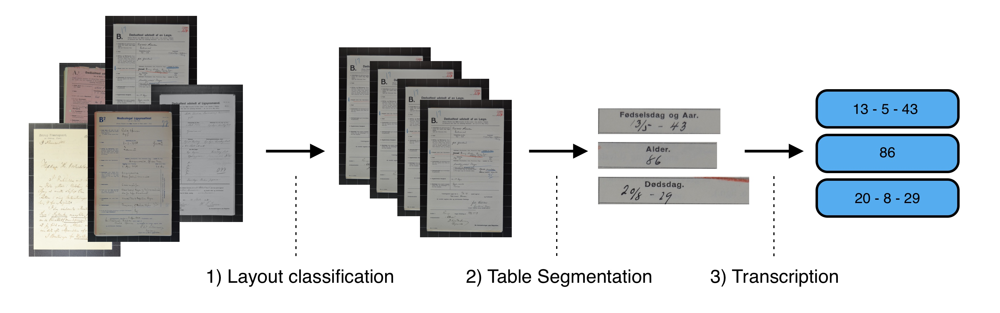
]

---
## From Source to Output

.center[
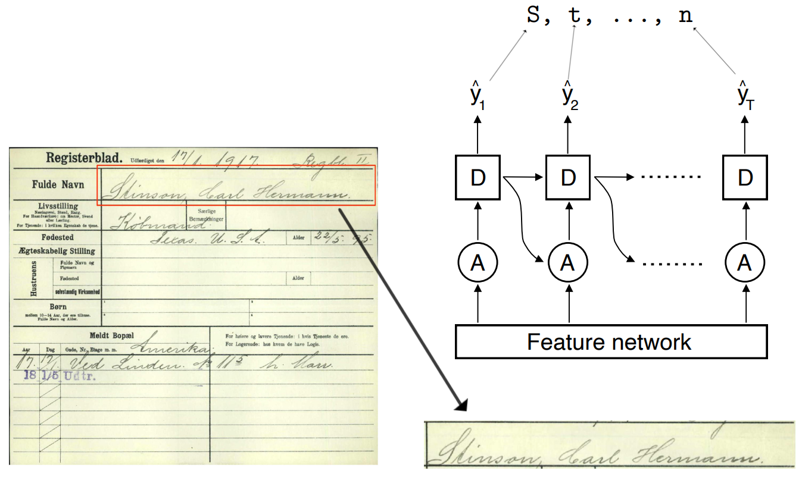
]

---
#### Vision Transformer Encoder / Transformer Decoder

.center[
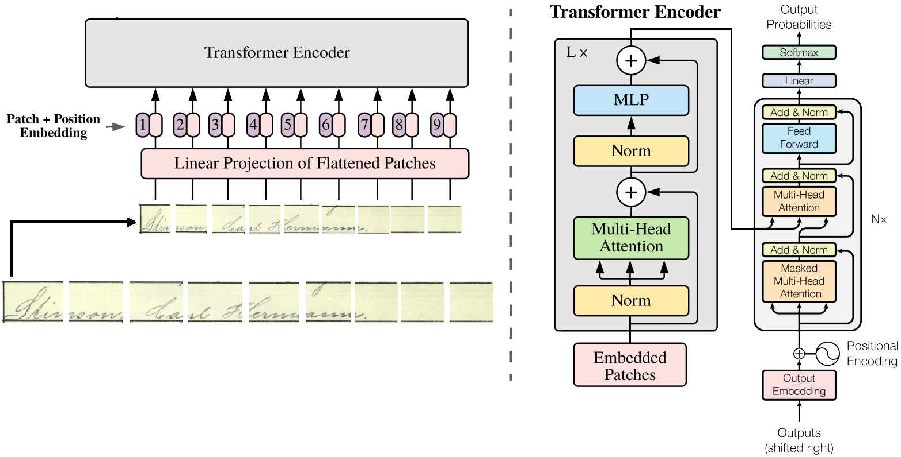
]

---
## Prerequisites

.pull-left-wide[
ML works by learning from data — as such, we need good models *and* data
]

.pull-left[
**Models**

Generalizable, accurate models
- High-level pipeline for end-to-end digitization
- HTR models achieving super-human performance

.small123[[doi.org/10.1080/01615440.2023.2164879](https://doi.org/10.1080/01615440.2023.2164879)]
]

.pull-right[
**Data**

Large-scale, high-quality datasets
- **HANA**: largest dataset of handwritten names
- **DARE**: largest dataset of handwritten dates

.small123[[doi.org/10.1016/j.eeh.2022.101473](https://doi.org/10.1016/j.eeh.2022.101473)]
]

---
## Performance: Dates

.center[
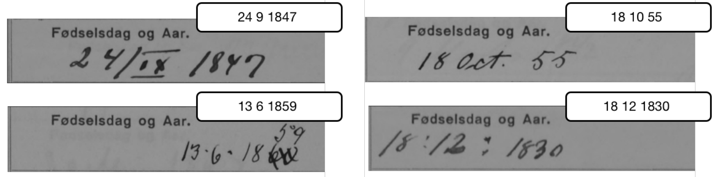
]

.small123[
| | Date | Day | Month | Year |
|---|---|---|---|---|
| Out-of-the-box | 73.9 | | | |
| ML ('19) | 90.5 | 96.0 | 97.0 | 97.2 |
| Crowd sourcing | 96.3 | 98.3 | 98.7 | 98.8 |
| ML ('22) | 97.7 | 99.2 | 99.0 | 99.2 |
| GPT-4o Mini | 77.9 | | | |
| Gemini-Flash 2.0 | 85.3 | | | |

Transcription Accuracy (%). "Out-of-the-box" performance refers to *Transkribus* ([readcoop.eu/transkribus](https://readcoop.eu/transkribus/)).
]

---
## Performance: Names

.center[
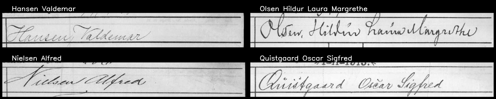
]

.small123[
| | CER First name | CER Last name | SER First name | SER Last name |
|---|---|---|---|---|
| ML ('20) | 1.4 | 1.5 | 4.9 | 5.7 |
| matched | 1.5 | 1.5 | 4.4 | 4.3 |
| ML ('22) | | 0.9 | | 3.2 |

CER = Character Error Rate, SER = Sequence Error Rate. Transcription accuracy (%).
]

---
## What *is* possible? Machine-written documents

.center[
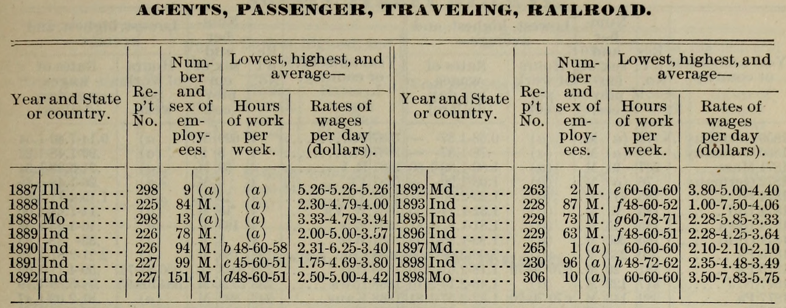
]

---
## What *is* possible? Machine-written documents

| Year and State/country | Rep't No. | Number and sex of employees | Hours of work per week | Rates of wages per day ($) |
|---|---|---|---|---|
| 1887 Ill | 298 | 9 (a) | (a) | 5.26-5.26-5.26 |
| 1888 Ind | 225 | 84 M. | (a) | 2.30-4.79-4.00 |
| 1888 Mo | 298 | 13 (a) | (a) | 3.33-4.79-3.94 |
| 1889 Ind | 226 | 78 M. | (a) | 2.00-5.00-3.57 |
| 1890 Ind | 226 | 94 M. | 48-60-58 | 2.31-6.25-3.40 |
| 1891 Ind | 227 | 99 M. | c 45-60-51 | 1.75-4.69-3.80 |
| 1892 Ind | 227 | 151 M. | d 48-60-51 | 2.50-5.00-4.42 |
| 1892 Md. | 263 | 2 M. | e 60-60-60 | 3.80-5.00-4.40 |
| 1893 Ind | 228 | 87 M. | f 48-60-52 | 1.00-7.50-4.06 |
| 1895 Ind | 229 | 73 M. | g 60-78-71 | 2.28-5.85-3.33 |
| 1896 Ind | 229 | 63 M. | f 48-60-51 | 2.28-4.25-3.64 |
| 1897 Md. | 265 | 1 (a) | 60-60-60 | 2.10-2.10-2.10 |
| 1898 Ind | 230 | 96 (a) | h 48-72-62 | 2.35-4.48-3.49 |
| 1898 Mo | 306 | 10 (a) | 60-60-60 | 3.50-7.83-5.75 |

---
## Machine-written documents — errors

.center[
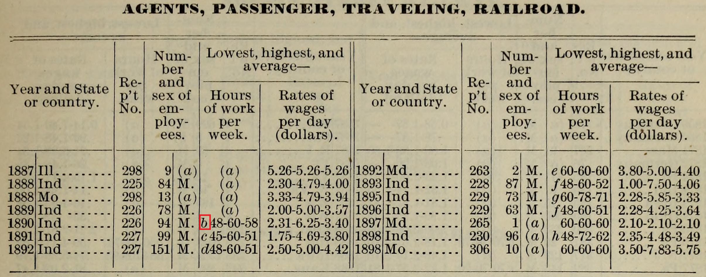
]

---
class: xtiny-code
## How to Use LLMs for Large-Scale Transcription

```
The image shows one or multiple tables. Each table contains the five columns:
- Year and State or country.
- Rep't No.
- Number and sex of employees.
- Hours of work per week.
- Rates of wages per day (dollars).

Further, note that each row essentially consists of two tables, that is, there
are two tables next to each other, such that each row holds ten values, five
of which belongs to the left side and five to the right side table.

I want you to transcribe ALL the contents (all rows) of ALL the tables in the
image, and return it in JSON format, where each row consists of the fields:
- Year and State or country.
- Rep't No.
- Number and sex of employees.
- Hours of work per week.
- Rates of wages per day (dollars).
- Table title.
where the table title is the title above the specific table.

The output for a row might look like:
{
    "Year and State or country.": "1860 Germany",
    "Rep't No.": "185",
    "Number and sex of employees.": "(a) M.",
    "Hours of work per week.": "(a)",
    "Rates of wages per day (dollars).": "0.36-0.36-0.36",
    "Table title": "ACCORDION MAKERS"
}
```

---
## How to Use LLMs for Large-Scale Transcription

We do **not** want to use the graphical interface when working with large collections (tedious and worse). Instead, we use an `API`

.center[

]

---
## How to Use LLMs for Large-Scale Transcription

In Python, this could be in the form of a script like:
.small123[
```{python, eval=FALSE}
prompt = '''
The image shows one or multiple tables.
Each table contains the five columns:
- Year and State or country.
- Rep't No.
- Number and sex of employees.
- Hours of work per week.
- Rates of wages per day (dollars).
...
'''

import google.generativeai as genai

model = genai.GenerativeModel(model_name='gemini-2.5-flash')
file = genai.upload_file('./Figures/44.jpg')

transcription = model.generate_content(
    [file, "\n\n", prompt]
)
```
]

---
## How to Use LLMs for Large-Scale Transcription

.tiny123[
```
[
  {
    "Year and State or country.": "1887 Ill.",
    "Rep't No.": "298",
    "Number and sex of employees.": "9 (a)",
    "Hours of work per week.": "(a)",
    "Rates of wages per day (dollars).": "5.26-5.26-5.26",
    "Table title": "AGENTS, PASSENGER, TRAVELING, RAILROAD."
  },
  {
    "Year and State or country.": "1888 Ind",
    "Rep't No.": "225",
    "Number and sex of employees.": "84 M.",
    "Hours of work per week.": "(a)",
    "Rates of wages per day (dollars).": "2.30-4.79-4.00",
    "Table title": "AGENTS, PASSENGER, TRAVELING, RAILROAD."
  },
  ... # 39 more rows, spanning several distinct tables/titles
]
```
]
.small123[The model transcribes every row of every table in the image — here, 41 rows across multiple occupational categories, in a single structured pass]

---
# .red[Exercise: Transcription]

.pull-left-wide[
Let's try to train our own transcription model. You can find this exercise as a [Colab hosted notebook](https://colab.research.google.com/drive/1GnpFi2xGQDfOkvdito0gRVvlx9BybZcW?usp=sharing) or locally as `exercises/exercise-transcription.ipynb`

1. Try experimenting with an alternative (non-linear) activation function to the `sigmoid` function used in the baseline model. A list of activation functions is available [here](https://pytorch.org/docs/stable/nn.functional.html#non-linear-activation-functions)
2. Try changing the number of channels in the first convolutional layer (`self.conv1`) from 16 to 32. What else do you need to change to ensure the model still works? How does this affect the number of parameters of the model?
]

---
# Before next time

.pull-left[
- Review today's notebooks and finish any exercises you didn't get to
- Explore the OccCANINE and transcription repositories linked throughout the slides
]

.pull-right[

]
